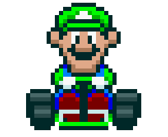

<h1>Project Challenge: Mario Kart.JS</h1>

  <table>
        <tr>
            <td>
                
            </td>
            <td>
                <b>Objective:</b>
                
Mario Kart is a racing game series developed and published by Nintendo. Our challenge will be to create video game logic to simulate Mario Kart races, taking into account the rules and mechanics below.

            </td>
        </tr>
    </table>

<h2>Players</h2>
      <table style="border-collapse: collapse; width: 800px; margin: 0 auto;">
        <tr>
            <td style="border: 1px solid black; text-align: center;">
                
Mario

                
            </td>
            <td style="border: 1px solid black; text-align: center;">
                
Speed: 4

                
Maneuverability: 3

                
Power: 3

            </td>
             <td style="border: 1px solid black; text-align: center;">
                
Peach

                
            </td>
            <td style="border: 1px solid black; text-align: center;">
                
Speed: 3

                
Maneuverability: 4

                
Power: 2

            </td>
              <td style="border: 1px solid black; text-align: center;">
                
Yoshi

                
            </td>
            <td style="border: 1px solid black; text-align: center;">
                
Speed: 2

                
Maneuverability: 4

                
Power: 3

            </td>
        </tr>
        <tr>
            <td style="border: 1px solid black; text-align: center;">
                
Bowser

                
            </td>
            <td style="border: 1px solid black; text-align: center;">
                
Speed: 5

                
Maneuverability: 2

                
Power: 5

            </td>
            <td style="border: 1px solid black; text-align: center;">
                
Luigi

                
            </td>
            <td style="border: 1px solid black; text-align: center;">
                
Speed: 3

                
Maneuverability: 4

                
Power: 4

            </td>
            <td style="border: 1px solid black; text-align: center;">
                
Donkey Kong

                
            </td>
            <td style="border: 1px solid black; text-align: center;">
                
Speed: 2

                
Maneuverability: 2

                
Power: 5

            </td>
        </tr>
    </table>

<h3>🕹️ Rules & mechanics:</h3>

<b>Players:</b>

<input type="checkbox" id="jogadores-item" />
<label for="jogadores-item">The Computer must receive two characters to compete in the race, each stored in an object</label>

<b>Tracks:</b>

<ul>
  <li><input type="checkbox" id="pistas-1-item" /> <label for="pistas-1-item">The characters will race on a random track of 5 rounds</label></li>
  <li><input type="checkbox" id="pistas-2-item" /> <label for="pistas-2-item">In each round, a track block will be drawn, which can be a straight, curve, or confrontation</label>
    <ul>
      <li><input type="checkbox" id="pistas-2-1-item" /> <label for="pistas-2-1-item">If the track block is a STRAIGHT, the player must roll a 6-sided die and add the SPEED attribute; whoever wins gets one point</label></li>
      <li><input type="checkbox" id="pistas-2-2-item" /> <label for="pistas-2-2-item">If the track block is a CURVE, the player must roll a 6-sided die and add the MANEUVERABILITY attribute; whoever wins gets one point</label></li>
      <li><input type="checkbox" id="pistas-2-3-item" /> <label for="pistas-2-3-item">If the track block is a CONFRONTATION, the player must roll a 6-sided die and add the POWER attribute; whoever loses, loses one point</label></li>
      <li><input type="checkbox" id="pistas-2-3-item" /> <label for="pistas-2-3-item">No player can have a negative score (values below 0)</label></li>
    </ul>
  </li>
</ul>

<b>Victory Condition:</b>

<input type="checkbox" id="vitoria-item" />
<label for="vitoria-item">At the end, whoever has accumulated the most points wins</label>
